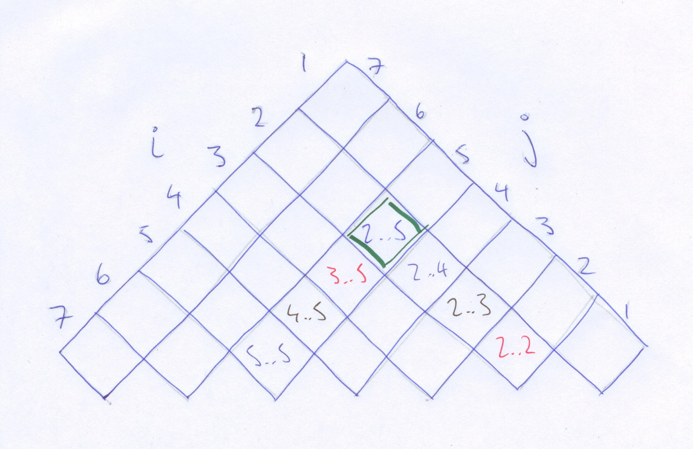

% Dynamic Programming in Haskell
% Thomas Sutton, Anchor
% 2015-05-27

# Introduction

## Introduction

This is a talk in two parts:

1. First I'll introduce [dynamic programming][wp:dp] and describe several
example problems.

2. Second I'll described a framework for addressing these problems in
[Haskell][haskell] using the [vector][hs:vec] library.

# Dynamic Programming

## Dynamic programming

[*Dynamic programming*][wp:dp] is an approach to solving problems which exhibit
two properties:

- [*Optimal substructure*][wp:oss] - an **optimal solution** can be found
efficiently given optimal **solutions to its sub-problems**.

- [*Overlapping sub-problems*][wp:osp] - problems are divided into
**sub-problems** which **are used several times** in the calculation of
a solution to the overall problem.

In practice this means:

- Given optimal solutions to all immediate sub-problems you can efficiently
construct an optimal solution to your problem; and

- It is worthwhile computing solutions to all sub-problems, working bottom to
assemble them into a solution to the overall problem.

## Dynamic programming

Solving a single problem instance then requires:

1. Finding all candidate sub-problem/s;

2. Selecting the optimal sub-problem/s solutions; and

3. Combining the selected sub-problem/s solutions.

## Other approaches

Dynamic programming can be contrasted with other approaches:

- *Divide and conquer* algorithms have sub-problems which do not necessarily
overlap; so solutions to sub-problems are not re-used.

- *Greedy* algorithms work top-down selecting *locally* best sub-problems; so
the solutions aren't necessarily optimal.

- *Memoisation* algorithms maintain a cache past results so they can
short-circuit when the same problem is solved in future. This may or may not
actually improve the efficiency of a particular instance.

## Actually programming

Dynamic programming algorithms are often presented as a series of loops which
gradually fill in the cells of a tableau. Generally presented pretty
imperatively:

- for loops
- mutable state

## Actually programming

````
MATRIX-CHAIN-ORDER(p)
  n <- length[p] - 1
  for i <- 1 to n do
    m[i,i] <- 0
  for l <- 2 to n do
    for i <- 1 to n - l + 1 do
      j <- i + l - 1
      m[i,j] <- infinity
      for k <- i to j - 1 do
        q <- m[i,k] + m[k+1,j] + p[i-1] * p[k] * p[j]
        if q < m[i,j] do
          m[i,j] <- q
          s[i,j] <- k
  return m, s
````

(From CLRS 2nd ed; p. 336)

# Example problems

## Examples

There are many dynamic programming problems, I'll be using the following as
examples:

- *Matrix-chain multiplication* - given a sequence of compatible matrices, find
the optimal order in which to associate the multiplications.

- *String edit distance* - given two strings, find the lowest-cost sequence of
operations to change the first into the second.

# Matrix-chain multiplication

## Matrix-chain multiplication

Matrix multiplication is a pretty big deal. Assuming you have two matrices with
dimensions $A_{1} : m \times n$ and $A_{2} : n \times o$ then multiplying them
will take $O(m \times n \times o)$ scalar operations (using the naive
algorithm).

Matrix multiplication is associative (but not commutative) so we can "bracket"
a chain of $n>2$ matrices however we like. The matrix-chain multiplication
problem is to choose the best (i.e. least cost) way to bracket a matrix
multiplication chain.

First, let's see why we need an algorithm?

## Example: Multiply three matrices

\begin{align*}
A_1 &: 10 \times 100 \\
A_2 &: 100 \times 5 \\
A_3 &: 5 \times 50
\end{align*}

There are two ways we can evaluate the chain $A_1 A_2 A_3$: $(A_1 A_2) A_3$ or
$A_1 (A_2 A_3)$.

\begin{align*}
(A_1 A_2) A_3 &= (10 \times 100 \times 5) + (10 \times 5 \times 50) &&= 7500 \\
A_1 (A_2 A_3) &= (10 \times 100 \times 50) + (100 \times 5 \times 50) &&= 75000
\end{align*}

We've only had to make one choice and we've already done, potentially, an order
of magnitude too much work!

## Matrix-chain multiplication

- Suppose we have a chain $A_i A_{i+1} A_{i+2} ... A_{i+n}$ of $n$ matrices we
wish to multiply.

- Any solution splits the chain in two -- a left side and a right side -- which
must each be multiplied out before multiplying the results together.

- We are free to split at any point $j$ in the chain $1<j<n$.

- The left and right sides are both sub-problems.

## Matrix-chain multiplication

1. For all possible splitting points $s$:

    1. Calculate the cost of the right sub-problem; and

    2. Calculate the cost of the left sub-problem.

2. Solve the problem by choosing the splitting point $s$ to minimise:

    1. The cost of the left sub-problem $A_{i} .. A_{i+s}$; and

    2. The cost of the right sub-problem $A_{i+s+1} .. A_{i+n}$; and

    3. The cost of multiplying the solutions of the two sub-problems together.

In (1) we're calculating the solutions to all sub-problems and in (2) we're
choosing and combining the optimal sub-problems into an optimal solution.

A recursive implementation results in an enormous amount of repeated work, so
we'll use a dynamic algorithm.

## Matrix-chain multiplication

The key is a tableau which holds the intermediate sub-problems:


## Matrix-chain multiplication


## Matrix-chain multiplication



# String edit distance

## String edit distance

Given two strings, find the optimal cost (and/or the sequence of operations) to
transform the first string into the latter.

We aren't committed to any particular set of operations but we'll use:

   - Insert: $cost(cat \rightarrow chat) = 1$

   - Delete: $cost(cat \rightarrow ca) = 1$

   - Substitute: $cost(cat \rightarrow sat) = 1$

## String edit distance

The tableau for a string edit distance problem is a little simpler, it's just
an $n \times m$ matrix for "from" and "to" strings of $n$ and $m$ symbols:

\begin{center}
\begin{tabular}{ r | r | r | r | r | r | r | r | r | r | }
   &  $\epsilon$ &  s &  a &  t &  u &  r &  d &  a &  y \\ \hline
$\epsilon$  &    &    &    &    &    &    &    &    &    \\ \hline
c  &    &    &    &    &    &    &    &    &    \\ \hline
a  &    &    &    &    &    &    &    &    &    \\ \hline
t  &    &    &    &    &    &    &    &    &    \\ \hline
\end{tabular}
\end{center}

(Well actually, it's $(n+1)\times(m+1)$.)

## String edit distance

The sub-problem structure here comes from the prefix structure of the strings
themselves.

Given some optimal solution for $cost(s \rightarrow t)$, we can solve:

- Extend: $cost(s\smallfrown c \rightarrow t\smallfrown c) = cost(s \rightarrow t)$
- Delete: $cost(s\smallfrown c \rightarrow t) = cost(s \rightarrow t) + delete$
- Insert: $cost(s \rightarrow t\smallfrown c) = cost(s \rightarrow t) + insert$
- Substitute: $cost(s\smallfrown c \rightarrow t\smallfrown d) = cost(s \rightarrow t) + subst$

## String edit distance

The trivial cases in string edit distance are a tiny bit less trivial than for
MCM:

\begin{center}
\begin{tabular}{ r | r | r | r | r | r | r | r | r | r | }
   &  $\epsilon$ &  s &  a &  t &  u &  r &  d &  a &  y \\ \hline
$\epsilon$  &  0 &  1 &  2 &  3 &  4 &  5 &  6 &  7 &  8 \\ \hline
c  &  1 &    &    &    &    &    &    &    &    \\ \hline
a  &  2 &    &    &    &    &    &    &    &    \\ \hline
t  &  3 &    &    &    &    &    &    &    &    \\ \hline
\end{tabular}
\end{center}

## String edit distance

Filling in the rest of the tableau is pretty straightforward:

````
if s[x] == t[y]
then
    m[x,y] <- m[x-1,y-1]    -- Nop: ↖ + 0
else
    m[x,y] <- min
        { m[x-1,y  ] + 1    -- Ins: ← + 1
        , m[x  ,y-1] + 1    -- Del: ↑ + 1
        , m[x-1,y-1] + 1    -- Sub: ↖ + 1
        }
````

## String edit distance

\begin{center}
\begin{tabular}{ r | r | r | r | r | r | r | r | r | r | }
   &  $\epsilon$ &  s &  a &  t &  u &  r &  d &  a &  y \\ \hline
$\epsilon$  &  0 &  1 &  2 &  3 &  4 &  5 &  6 &  7 &  8 \\ \hline
c  &  1 &  1 &  2 &  3 &  4 &  5 &  6 &  7 &  8 \\ \hline
a  &  2 &  2 &\bf ? &    &    &    &    &    &    \\ \hline
t  &  3 &    &    &    &    &    &    &    &    \\ \hline
\end{tabular}
\end{center}

$s[y] = t[x]$ so no edit operation required, this is an extension: $m[x,y] \leftarrow m[x-1,y-1]$.

## String edit distance

\begin{center}
\begin{tabular}{ r | r | r | r | r | r | r | r | r | r | }
   &  $\epsilon$ &  s &  a &  t &  u &  r &  d &  a &  y \\ \hline
$\epsilon$  &  0 &  1 &  2 &  3 &  4 &  5 &  6 &  7 &  8 \\ \hline
c  &  1 &  1 &  2 &  3 &  4 &  5 &  6 &  7 &  8 \\ \hline
a  &  2 &  2 &  1 &\bf ? &    &    &    &    &    \\ \hline
t  &  3 &    &    &    &    &    &    &    &    \\ \hline
\end{tabular}
\end{center}

$s[y] \neq t[x]$ so we check the cases:

- Insert "t": $m[x-1,y]+1$
- Delete "a": $m[x,y-1]+1$
- Replace "a" with "t": $m[x-1,y-1]+1$

We choose the least: $m[x,y] \leftarrow m[x-1,y]+1$.

## String edit distance

We can the cost from the cell $m[len(t),len(s)]$ or follow the path back
through the tableau to determine an edit script.

\begin{center}
\begin{tabular}{ r | r | r | r | r | r | r | r | r | r | }
   &  $\epsilon$ &  s &  a &  t &  u &  r &  d &  a &  y \\ \hline
$\epsilon$  &  \bf 0 &  1 &  2 &  3 &  4 &  5 &  6 &  7 &  8 \\ \hline
c  &  1 &\bf 1 &  2 &  3 &  4 &  5 &  6 &  7 &  8 \\ \hline
a  &  2 &  2 &\bf 1 &  2 &  3 &  4 &  5 &  6 &  7 \\ \hline
t  &  3 &  3 &  2 &\bf 1 &\bf 2 &\bf 3 &\bf 4 &\bf 5 &\bf 6 \\ \hline
\end{tabular}
\end{center}

This is usually called [Wagner-Fischer algorithm][wp:wfa] and about a dozen
other things.

## Structure of problems

- Both of these algorithms have nice, predictable and *complete* tableaux.

- Other algorithms make concessions to get a lower space bounds, but I'm not
interested in these.

# Implementation in Haskell

## Overview

The key observation is that all these algorithms start with an empty tableau
and gradually fill it in as they solve progressively larger sub-problems.

1. Find a total ordering on sub-problems. This generally falls out of the
structure of the problem.

1. Find a bijection $ix : prob \rightarrow \mathbb{N}$ between the natural
numbers and the problem parameters.

1. Implement the step function ("given optimal solutions to the
sub-problems...").

1. Glue them together with a framework to drive the recursion, extract the
answer, etc.

The tableaux may be awkward shapes and we'd like to avoid wasting, e.g.,
$O(\frac{n}{2})$ space if we can so making `ix` nice will be key.

## Framework

1. Ordering is determined by dependency (problems come after the sub-problems
they depend on); generally this is trivial from the parameters of
a sub-problem.

1. Implement a pair of functions (or an `Iso` when I can be bothered changing
the code) $ps :: Int \rightarrow problem$ and $ix :: problem \rightarrow Int$.

1. Implement a function which, given a `Vector a` of solved sub-problems, and
the parameters for a sub-problem, generates an optimal solution.

1. Glue these together by using `Data.Vector.constructN`.

## Implementation

````{.haskell}
type Size = Int
type Index = Size

dp :: (problem -> Index)
   -> (Index -> problem)
   -> (problem -> (problem -> solution) -> solution)
   -> Size
   -> solution
````

````{.haskell}
dp p2ix ix2p step n = V.last (C.constructN n solve)
  where
    solve :: Vector solution -> solution
    solve subs =
        let p = ix2p (V.length subs)
            get p = subs V.! (p2ix p)
        in step p get
````

## Wagner-Fischer algorithm

- We'll find `(Int, [Op])` solutions which include the lowest cost and the edit
script for the optimal solution.

- The vector is $n \times m$ long, each value depends only on cells before it
in the ordering.

- We map the $n \times m$ tableau to a `Vector` in the obvious way:

````{.haskell}
ix :: Size -> Problem -> Index
ix n (x,y) = (x * n) + y

param :: Size -> Index -> Problem
param n i = i `quotRem` n
````

## Wagner-Fischer algorithm

- And solving sub-problems is now just an analysis of cases:

````{.haskell}
solve (        0,         0) _ = (0, mempty)
solve (        0, pred -> y) g = op del (s V.! y) ' ' $ g (0,y)
solve (pred -> x,         0) g = op ins ' ' (t V.! x) $ g (x,0)
solve (pred -> x, pred -> y) get =
    let {s' = s V.! x; t' = t V.! y}
    in if s' == t' then (Nothing:) <$> get (x, y)
                   else minimumBy (compare `on` fst)
                       [ op del s' t' $ get (1+x, y)
                       , op ins s' t' $ get (x, 1+y)
                       , op sub s' t' $ get (x,y)
                       ]
````

## Wagner-Fischer algorithm

- Gluing these bits together we get:

````{.haskell}
editDistance :: Vector Char -> Vector Char -> Solution
editDistance s t = (reverse . catMaybes) <$>
    let {m = V.length s; n = V.length t}
    in dp (ix n) (param n) solve (m * n)
````

## Matrix-chain multiplication

- A solution `(Int, (Int, Int), Vector Int)` includes the number of scalar
multiplications, dimensions of the resulting matrix, and splitting points.

- For a chain of $n$ matrices the vector is $\frac{n * (n+1)}{2}$ long (this is
the $n$th triangular number).

- We map between the tableau and the vector a little trickily:

````{.haskell}
ix :: Size -> Problem -> Index
ix n (i,j) =
  let x = n - j + i + 1
  in i + (n * (n-1) `div` 2) - ((x-1) * x `div` 2)

param :: Size -> Index -> Problem
param n x = -- (ix n (i,j) = x), solve for (i,j)
````

## Matrix-chain multiplication

````{.haskell}
solve ms (i,j) get
    -- Sub-problem of length = 1.
    | i == j    = (0, ms V.! i, mempty)
    -- Sub-problem of length > 1; check the possible splits.
    | otherwise = minimumBy (compare `on` fsst) $
                  map subproblem [i..j-1]
  where
    subproblem s =
        let (lc, (lx,ly), ls) = get (i,s)
            (rc, ( _,ry), rs) = get (s+1,j)
        in ( lc + rc + (lx * ly * ry)
           , (lx, ry)
           , V.singleton s <> ls <> rs
           )
````

## Matrix-chain multiplication

````{.haskell}
-- | Solve a matrix-chain multiplication problem.
mcm :: Vector (Int,Int) -> (Int, (Int,Int), Vector Int)
mcm ms = let n = V.length ms
    in dp (ix n) (param n) (solve ms) (triangularNumber n)
````

# Conclusion

## Conclusions

- Dynamic programming is a great and fits naturally into standard libraries in
the Haskell ecosystem.

- The mutation used in the descriptions of many algorithms is often incidental;
you can probably find a way to remove it or hide it behind an API.

- Finding a suitable isomorphism $Index \leftrightarrow problem$ which orders
sub-problems appropriately is the key; if you care about complexity analysis of
the whole algorithm this should probably be $O(1)$.

- (Finding an appropriate $O(1)$ bijections between indexes in a funny-shaped
matrix and $\mathbb{N}$ can be tricky, especially if you can't remember
high-school algebra.)

[haskell]: https://www.haskell.org/
[hs:vec]: https://hackage.haskell.org/package/vector
[wp:dp]: https://en.wikipedia.org/wiki/Dynamic_programming
[wp:osp]: https://en.wikipedia.org/wiki/Overlapping_subproblems
[wp:oss]: https://en.wikipedia.org/wiki/Optimal_substructure
[wp:wfa]: https://en.wikipedia.org/wiki/Wagner%E2%80%93Fischer_algorithm
